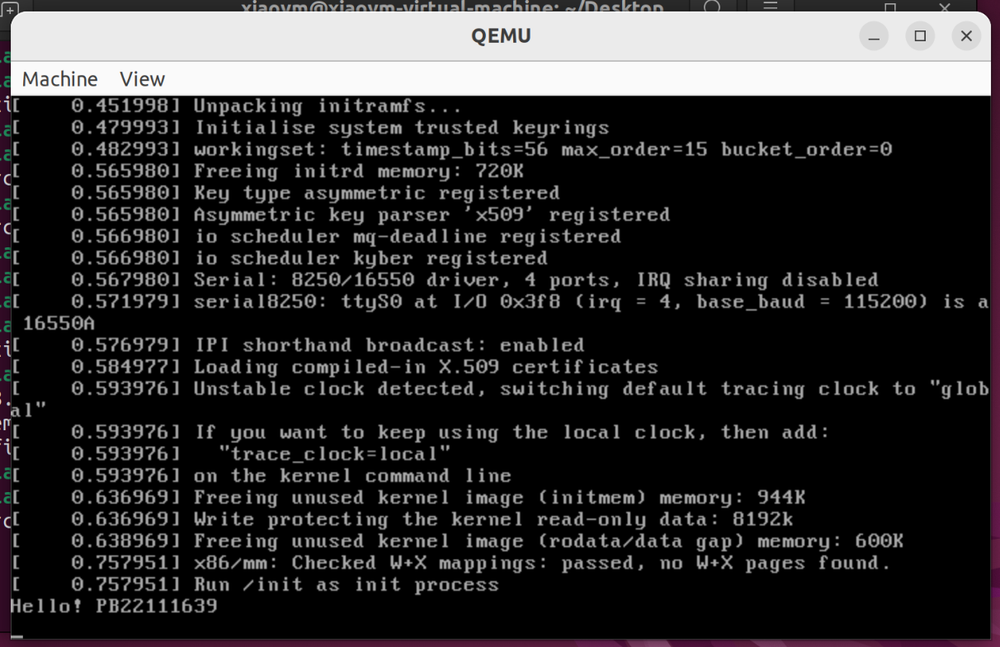
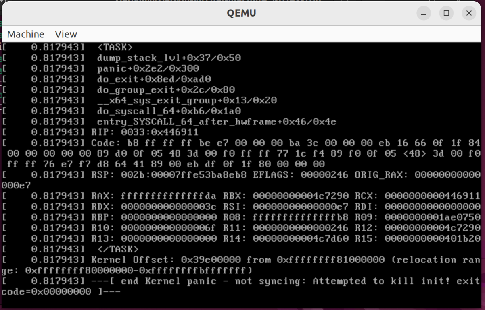
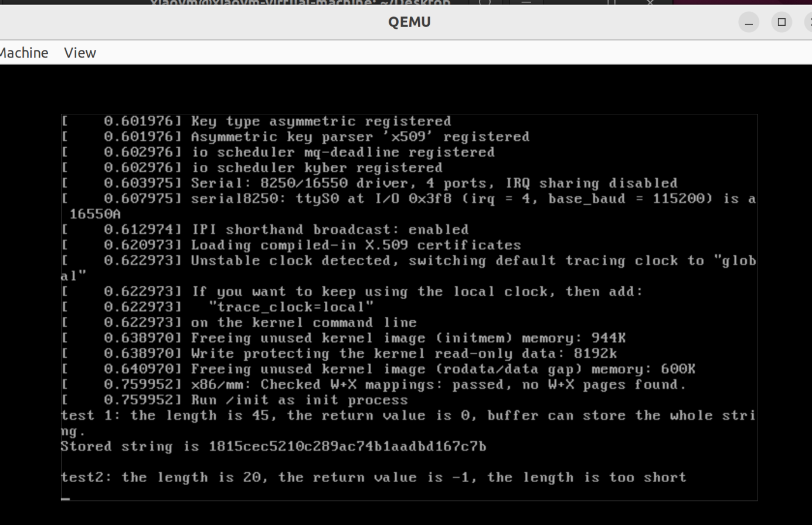

## 一、 Linux编译
### 【可选】影响编译时间和文件大小的主要部分
编译过程如下：
- 初始时，不修改内核，直接编译，得到文件大小为`12.9MB`
- 去除 `Networking support`，得到文件大小为`9.2MB`
- 去除`Mitigations for speculative execution vulnerabilities`，得到文件大小为`8.1MB`
- 去除`Device Drivers`，得到文件大小为`4.7MB`
- 去除`Power management and ACPI options`，得到文件大小为`4.2MB`
- 裁剪`File sysyems`，文件大小为`3.6MB`
- 裁剪`General architecture-dependent options`，文件大小为`3.5MB`
 
以下为后续裁减过程，提交的`bzImage`文件未裁减以下选项
- 裁减 `Cryptographic API`, 文件大小为`3.4MB`
- 裁减`Security operation`，文件大小为 `3.2MB`
- 裁减`Processor type and features`，文件大小为 `2.8MB`
 
此时文件大小为2.8MB，故推测剩余未裁减的部分影响不大
**故影响编译的主要部分大致有**
- `Networking support（网络支持）` 
- `Device Driver（设备驱动）`
- `Mitigations for speculative execution vulnerabilities`
- `File systems`
- `Power management and ACPI options` 
## 二、创建初始内存盘
#### 显示学号

### 【可选】 kernel panic
删去`init.c`中的`while(1){}`,并添加`return 0`语句可以造成`kernel panic`
qemu显示如下 ：

报错语句为` end Kernel panic - not syncing: Attempted to kill init!`
#### **kernel panic原因**： 
- kernel panic 指 kernel发生了致命错误导致无法继续运行下去的情况。
- linux在启动时，首先加载初始化内存盘进行初始化操作，init会作为第一个用户态进程被启动，成为所有后续进程的父进程。
- 当把while(1) 去掉或者改为return时，会试图退出init程序，导致后续进程缺失父进程，从而导致kernel panic。
所以在init.c中加入死循环防止init退出。
## 三、 添加自定义系统调用
 设置两个char数组，一个长度充足，一个长度不足，如果长度充足输出返回值和字符串的值，长度不足输出返回值
 运行结果：

