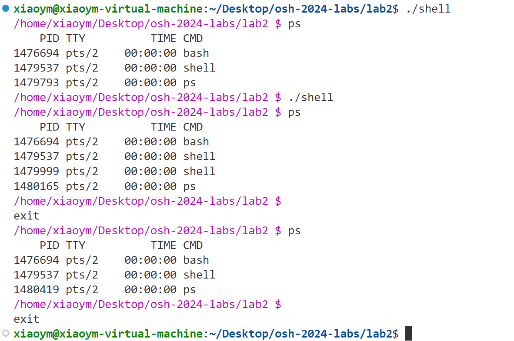

## Report
- 学号：`PB22111639`  &ensp; &ensp; 姓名：`马筱雅`
### 必做部分`100%`
#### 目录导航

#### 管道和重定向

#### 信号处理
- 可以终止进程，与bash不同点**在于按下Ctrl+C终止进程后无法换行**
- shell嵌套后能正确终止进程
- Ctrl+C可以丢弃命令

#### 前后台进程
- 后台运行
- 实现wait命令（其中设置后台指令后，需要调用wait）
在执行管道命令时，首先fork了一个子进程，管道命令在该子进程中执行，所以当管道命令设置为后台时，ps命令显示`shell<defunct>`

### 选做部分`25%`
#### `cd`默认进入家目录 `5%`
#### 实现`<<<`重定向 `5%`

#### 实现`history` `!n` `!!` `5%`
首先会先获取本地历史命令

#### 实现`alias` `5%`

#### 实现`CTRL+D` 退出shell
输入的命令的第一个字符需要是CTRL+D 

## 注：
**输入命令时最好按照相应格式，如**
- `| `符号两边各有一个空格
- `< <<< > >>`符号两侧各有一个空格，且只有一个空格
- `!` `history` 后面数字合法
- 最好不要随便使用`除CTRL+C,Ctrl + D 之外`的信号, 因为我不太确定会发生什么。。

