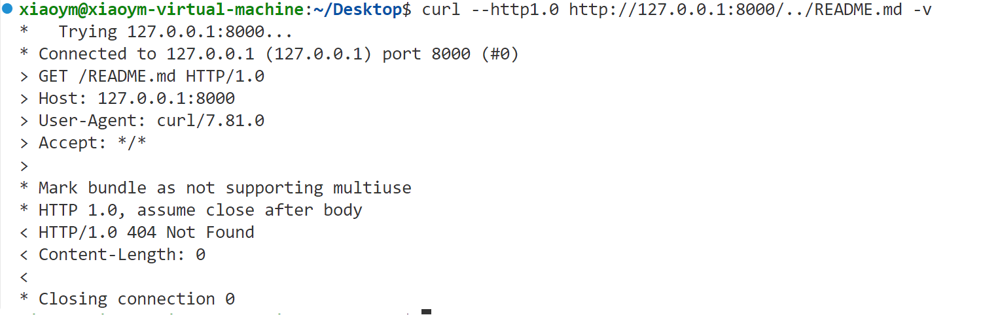

# Lab3 Report
## 实验内容
1. 使用线程池机制`10%`
2. 使用I/O复用epoll实现`20%`
## 文件目录结构
```shell
├─lab3
│  ├─src
│  │  └─server.c    # 线程池实现
│  │  └─server_epoll.c   # epoll实现
│  │  └─unchanged.c   # 原函数
│  └─README.md     # 实验报告
```
## 编译运行方法
```shell
# 使用gcc编译
gcc -g server.c -o server
./server
gcc -g server_epoll.c -o epoll
./epoll
```
## 实验设计
### 解析和检验HTTP头
主要包含`parse_request`和`handle_clnt`两个函数
- `handle_clnt(int clnt_sock)` 函数
    - 首先循环读取请求，直到所读得的字符串的后四位为`\r\n\r\n`，认为读取完成，如果在读取过程中`read`函数返回值`< 0`，则可认为该函数执行错误，若`= 0`，则表示读取完成得到的请求头中无`\r\n\r\n`，即请求头不完整
    - 接着调用`parse_request` 函数解析请求头

- `parse_request` 函数
    - 函数返回值：`-1` 表示 `500 Internal Server Error`，`-2` 表示`404 Not Found`，`0`表示请求头正确。
    - 得到的请求为`request`，首先判断是否为`GET`请求，不是则返回`-1`
    - 接着通过判断出现`../`或者`..`的次数和`/`的次数之差来判断是否跳出当前目录，跳出则返回`-1`，未跳出则得到文件路径。
    - 最后判断是否包含`HTTP/1.1\r\nHost: 127.0.0.1:8000`或者`HTTP/1.0\r\nHost: 127.0.0.1:8000`，不包含则返回`-1`。

### 读取请求内容
- 读取请求内容在`handle_clnt(int clnt_sock)` 函数中实现。
- 在`handle_clnt`函数调用`parse_request` 函数后，得到文件路径，在请求头合法时，调用`stat`函数判断是否为目录，并判断文件是否存在，从而进行相应的处理。若文件路径符合要求，则循环读取文件内容并写回客户端。

### 线程池/多线程部分
- 定义线程池结构体
    ``` C
    typedef struct{
        pthread_mutex_t lock;
        pthread_cond_t queue_not_full;   // 队列满
        pthread_cond_t queue_not_empty;  //队列不为空
        pthread_t *threads;  //存放线程的tid
        int *tasks_queue;    // 任务队列
        int thread_num; // 线程数
        int queue_front;  //队头
        int queue_tail;   //队尾
        int queue_size;   // 当前任务数
        int queue_max_size; //队列最大长度
    }threadpool;
    ```
- 定义线程池函数
    ```C
    void *threadpool_op(void *thread_pool);    // 取出线程池中一个任务并执行
    threadpool *threadpool_create(int queue_max_size, int thread_num);  //创建线程池
    void threadpool_add_task(int clnt_sock, threadpool *pool); //向线程池中添加任务
    ```
- 具体函数实现
   `threadpool_create`：创建线程池，并初始化变量，创建多个线程
   `threadpool_add_task`：首先加入互斥锁，接着判断是否队满，队满则等待，接着添加任务，并通知队非空，最后解开互斥锁。
   `threadpool_op`：首先加入互斥锁，接着判断是否队空，队空则等待，然后取出任务，并通知队未满，解开互斥锁，最后执行任务。

### I/O复用epoll
- 采用边缘触发，设置非阻塞
- 具体实现方式
    - 首先创建`event_list`对象，并设置非阻塞。接着调用`epoll_ctl`添加要调用的`server_socket`。`server_socket`接收数据，改变`event_list`队表
    - 当`event_list[i].data.fd == server_socket`时，表示有新连接，则循环接收请求，并设置非阻塞，添加至就绪队列。同时设置为边缘触发`EPOLLIN | EPOLLET`。
    - 当`event_list[i].events == EPOLLIN`时，进行读处理，此时调用`handle_clnt`函数解析请求（与线程池相比，该handle_clnt函数中删去了正常文件写入客户端的部分），如果文件可以正常打开返回文件描述符，并更改event状态，否则返回值为-1或-2，表示不同错误类型。
    - 当`event_list[i].events == EPOLLOUT`时，执行写入客户端操作，根据上个部分的返回值判断写回数据。如果上部分的返回值为文件描述符，则循环调用`sendfile`函数写入客户端，直到文件写入完全，并关闭客户端。

## 实验结果
### 结果测试
- 正常情况
    
<br>
- 目录

    
<br>
- 文件不存在

    
<br>
- 跳出当前目录

    
<br>
- 请求头不是GET

    

### 性能测试
- 未优化版本
    
- 线程池
    
- epoll
    

使用`siege -c 100 -r 20 http://127.0.0.1:8000/test.html -v`命令进行测试，可以看出使用线程池和epoll后，`elapsed_time`，`response_time`，`longest_transaction`都有所降低，而`concurrency`，`throughput`，`transaction_rate`都有所升高，说明使用线程池和epoll后并发性，响应时间，传输效率等都得到了优化。
线程池和epoll相比，各个指标差距不大
**增加测试文件的大小至约32K**
线程池

epoll

**增加测试文件的大小至约32K**
epoll

线程池

可以看出epoll的并发性更强，最长事务时间较短，而线程池的`transaction_rate`较大，`troughput`较大，两者各有优劣。